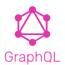

## <h1 align='center'> Hi , I’m 🌸 @esther-kpet! 🌸</h1>
<br />
I'm a UI/UX Designer || Full Stack Web Developer || Freelancer. I spend most of my time designing and coding projects or listening to music.  
<br>  

- 👀 I’m interested in web development, DevOps & cloud computing.  
  
-  👩🏻‍💻 I'm working as the Leader designer at my current company.
-  🌱 I’m currently learning DevOps automation tools such as Maven, Jenkins, ansible, terraform, and Docker.  
- 💞️ I’m looking to collaborate on a DevOps project to get hands-on practical skills and experiences.  
- 📫 How to reach me: via email: dev@estherkpetemey.com
  <br>  
  
### Find Me On Online Channels:
[](https://www.youtube.com/channel/UCHbnIppTZRyZEdS2K33uCMw) [](https://www.linkedin.com/in/esther-e-a-kpetemey/) [](https://instagram.com/esther_kpet) [](mailto:agilelytm@yahoo.com)


<!---
esther-kpet/esther-kpet is a ✨ special ✨ repository because its `README.md` (this file) appears on your GitHub profile.
You can click the Preview link to take a look at your changes.
--->

<br />
<br />

⚒ **The main stack of technologies I use:**
<div>
    &nbsp;&nbsp;
    &nbsp;&nbsp;
    &nbsp;&nbsp;
</div>
<br />

⚒ **... as well as:**
<div>
    &nbsp;&nbsp;
    &nbsp;&nbsp;
    &nbsp;&nbsp;
    &nbsp;&nbsp;
    &nbsp;&nbsp;
    &nbsp;&nbsp;
    &nbsp;&nbsp;
    &nbsp;&nbsp;
    &nbsp;&nbsp;
    &nbsp;&nbsp;
    &nbsp;&nbsp;
    &nbsp;&nbsp;
    &nbsp;&nbsp;
    &nbsp;&nbsp;
    &nbsp;&nbsp;
    &nbsp;&nbsp;
    &nbsp;&nbsp;
    &nbsp;&nbsp;
    &nbsp;&nbsp;
    &nbsp;&nbsp;
    &nbsp;&nbsp;
    &nbsp;&nbsp;
    &nbsp;&nbsp;
    &nbsp;&nbsp;
    &nbsp;&nbsp;
</div>
<br />

## 🔎 How to reach me:
<p>Email me: <a href='mailto:dev@estherkpetemey.com'>dev@estherkpetemey.com</a> or <a href='mailto:hello@agilely.site'>hello@agilely.site</a> or welcome to <a href='https://portfolio.estherkpetemey.com' alt='Esther Kpetemey Personal Portfolio Website' target='_blank'>my private website</a>!</p>


🔬 **My future interests:**
<div>
    &nbsp;&nbsp;
    &nbsp;&nbsp;
</div>
<br />

## 🎯 Projects:
<br />

| Title        | Type        | Description          | Technologies  |
| ------------- | ------------- | ------------- | ----- |
| [Food Ordering App for Family Dinner (UI Design)](https://www.behance.net/agilely) | <div align='center' title='Persoanl Projec' >📋</div> | Current mobile App User Interface | Adobe XD, PhotoShop |
| [Food Ordering App for Family Dinner (UX Design](https://apps.apple.com/ru/app/docuforce/id1583931741) | <div align='center' title='Persoanl Project' >📋</div> | Current mobile App User Experience Design | Adobe XD, JustInMind |
| [Agilely Freelance](https://esther-kpet.github.io/agilely_freelance/index.html) | <div align='center' title='Private Agency Website'>💰</div> | Web Development, UI/UX Design and Digital Marketing Agency |  HTML5, CSS, JavaScript, SASS/SCSS, BootStrap |
| Dummy Professional Website Design | <div align='center' title='Portfolio' >🚀</div> | Web Design for a fictive Agency | HTML5, JavaScript,SASS/SCSS, Git |
| [Digital Clock 🕚 (Web)](https://esther-kpet.github.io/iva-clock.github.io/) | <div align='center' title='Portfolio' >👩‍💻</div> | Web App displaying current time | HTML5, JavaScript, Git, SASS/SCSS, GitHubPages |
| Sloevour (e-commerce website)| <div align='center' title='Commercial'>💰</div> | Cloth and sports accessories ordering website | Shopify Partner |
| [Full Pocket(UI Design)] | <div align='center' title='Internship'>📋</div> | Full UI Design for a Bank App(Internship) | Figma, PhotoShop |
| [Personal Portfolio Website](https://portfolio.estherkpetemey.com/) | <div align='center' title='Personal Website'>👩‍💻</div> | My portfolio website: with my various projects and competencies | JavaScript, HTML5, SASS/SCSS|
|Alien Game| <div align='center' title='Private'>🚀</div> | GUI Game | Python, shell scripting| <div align='center' title='Training'>🎓</div> | Library Management System  |
|eLib(GUI App)| <div align='center' title='College Minor Project'>🎓</div> | A library management system GUI app: adding books, finding authors, searching books, deleting books, etc | Python, PyMySQL, Tkinter | 
|IvaTrivia| <div align='center' title='Training'>🎓</div> | Trivia Game: android app | Kotlin, Android Studio|
|My Calculator| <div align='center' title='Personal Project'>👩‍💻</div> | A fully functional scientific calculator | Flutter, Dart|
|Food Ordering App| <div align='center' title='Major Project'>🎓</div> |Online Food Ordering App|Kotlin, Android Studio|
<br />

## <h1 align="left">👩🏽‍💻 Waka Time Stats</h1>
<div align='left'>
    
</div>

<br />

<!--START_SECTION:waka-->

```txt
From: 28 February 2021 - To: 25 February 2025

Total Time: 104 hrs 21 mins

HTML             24 hrs 2 mins   >>>>>>-------------------   23.03 %
JavaScript       15 hrs 8 mins   >>>>---------------------   14.51 %
XML              12 hrs 46 mins  >>>----------------------   12.25 %
Markdown         12 hrs 23 mins  >>>----------------------   11.88 %
Kotlin           11 hrs 28 mins  >>>----------------------   10.99 %
```

<!--END_SECTION:waka-->
<br />

## <h1 align="left">Profile Visits</h1>


<br/>

## <h1 align="left">📈 GitHub Stats </h1>
[](https://github.com/anuraghazra/github-readme-stats)


<br>

## <h1 align="left">📈 Streak Stats Heroku</h1>
<div >
    
</div>


